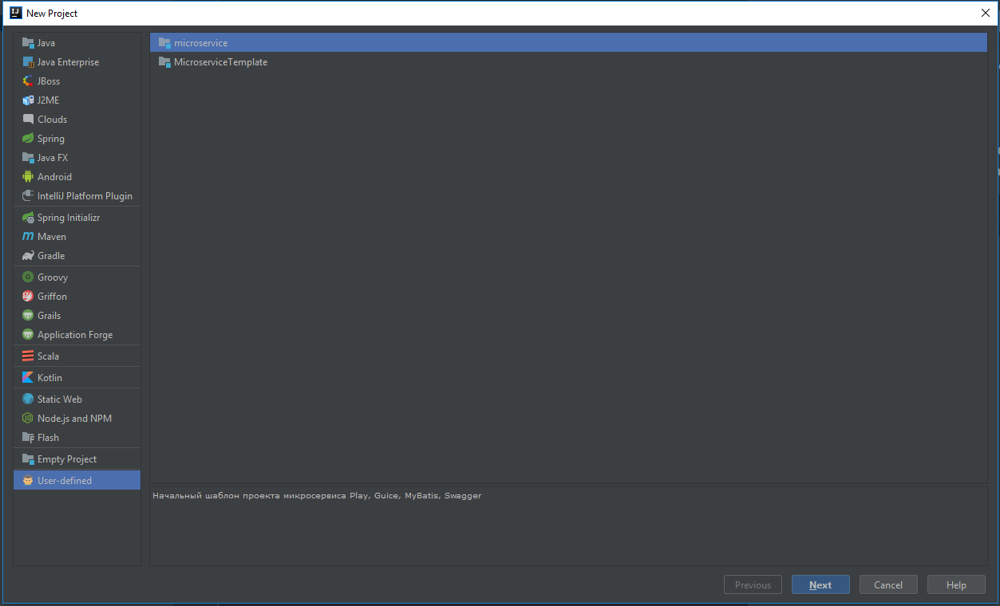

# microservice-template
Here u can find IntellijIdea's microservice template for following stack-> Play 2.6.18, Swagger-Play, MyBatis, Guice
  
 **Instruction**
  
 If u working with Intellij IDEA on Windows OS, then it's easier to find directory
where to put `microservice.zip` archive within project templates folder:

```$xslt
C:\Users\<username>\.IntelliJIdea2018.2\config\projectTemplates
```



# Applying template on MacOS X

## Install docker
Follow this link in a case you don't have existing docker installation: https://docs.docker.com/docker-for-mac/
Verify it using the following command: ```docker -version```


## Execute following commands

```
cd ~/Downloads
curl -o microservice.zip https://github.com/isatimur/microservice-template/raw/master/microservice.zip
mkdir  ~/Library/Preferences/IntelliJIdea2018.2/projectTemplates
cp ~/Downloads/microservice.zip ~/Library/Preferences/IntelliJIdea2018.2/projectTemplates
```

## Create project in IDE
Open project in idea: “File/New/Project…/User-defined” and import it as a SBT project

## Launching database
Execute ```docker-compose up``` from your project directory. Make sure that ```application.conf``` was modified according to the docker postgres settings.

## Running application
Try to execute ```sbt run``` and then open ```http://localhost:9000/``` URL. You should observe blank page without any issues.

Page ```http://localhost:9000/hello``` should respond with a message "Hello, world"